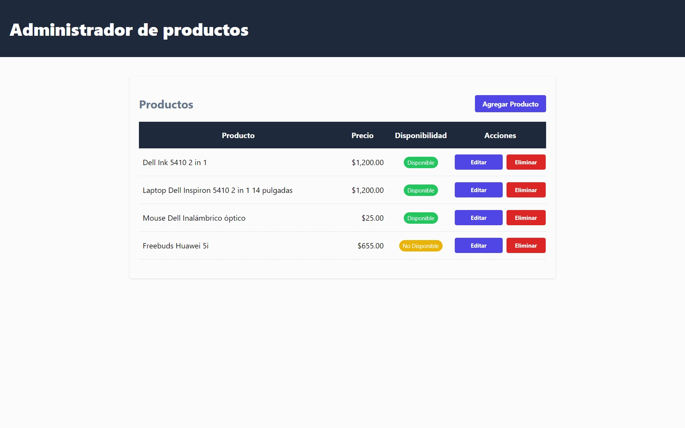
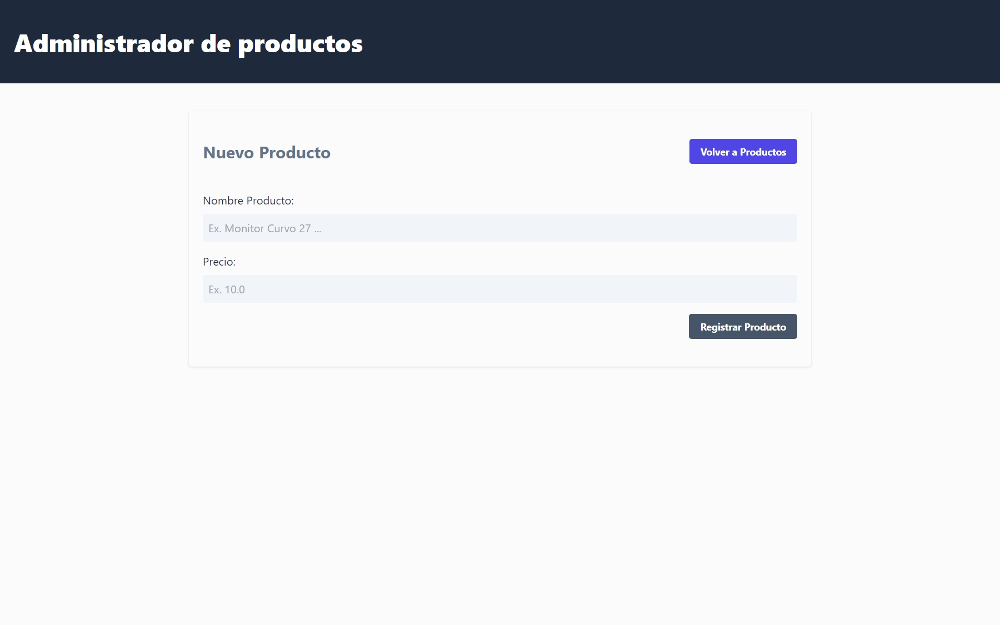
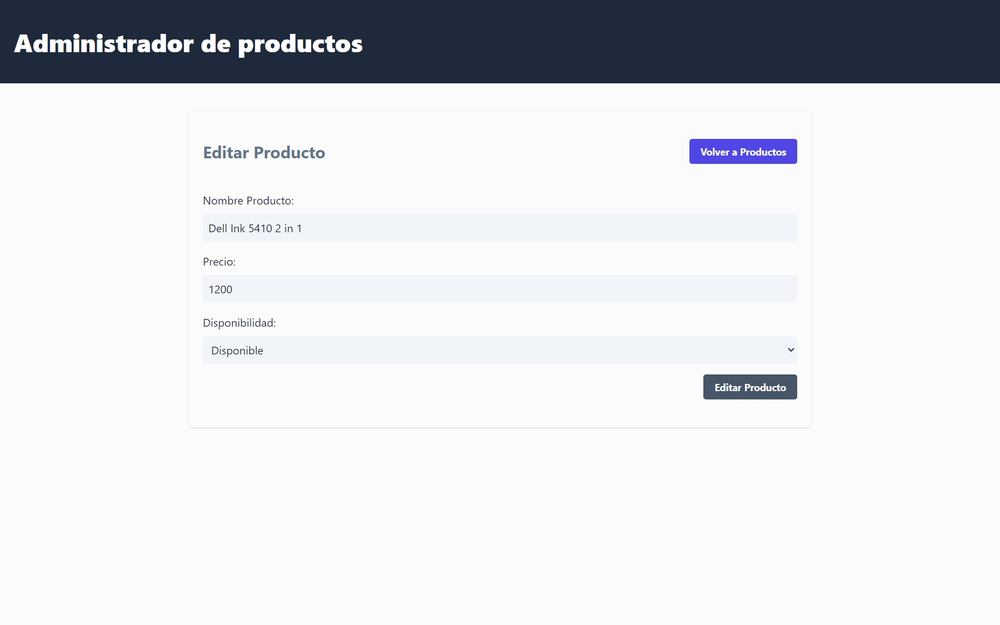

# Administrador de Productos React - Typescript

CRUD de productos utilizando React con TypeScript, routing lado cliente con React-Router, Vite como bundle,  y Tailwind para los estilos de la app. Se utiliza Axios para realizar peticiones a una REST API y Zod para validar las respuestas de la API.

## Tecnologías

* React
* TypeScript
* React-Router-Dom
* Tailwind
* Zod

> [!NOTE]
> Ver las versiones en el package.json

## Características

* Responsividad
* Estilos con Tailwind
* Code-splitting de las rutas usando `lazy`
* Implementación de loaders y actions de react-router

## Flujo de la aplicación

1. Listar los productos y brindar la capacidad de poder Editar su información, Eliminar el propio producto y modificar su estatus con `fetcher.Form` de react-router.

2. Funcionalidad de crear nuevos productos en la base de datos, validación lado cliente con Zod y navegación sin necesidad de recargar la página.

3. Funcionalidad de editar la información de un producto particular y el uso de redirect en un action para navegar en la SPA.

4. Funcionalidad de eliminar un producto de la base de datos y revalidar la información utilizando `fetcher.Form` de react-router.
